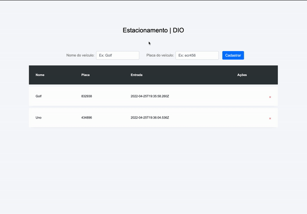

# Fala aí, de boa? Aqui foi um desafio de typescript da Digital Innovation One 🙃

- Foi feito um mini crud simulando um estacionamento utilizando o Typescript!
- Adicionei uma eslização utilizando o bootstrap.

### Tela

### Tecnologias utilizadas:

- [ Typescript ](https://www.typescriptlang.org/)
- [ HTML ](https://www.w3schools.com/html/)
- [ CSS ](https://developer.mozilla.org/pt-BR/docs/Web/CSS)
- [ Bootstrap ](https://getbootstrap.com/)

## 🚀 Vamos codificar! 🚀
